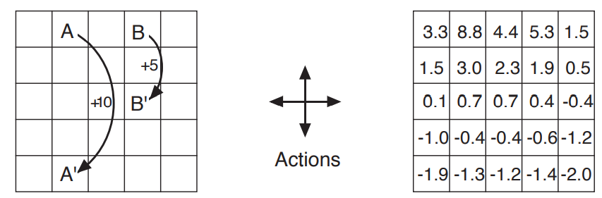

# Gridworld Example



5X5 Grid안에서   
Action은 상,하,좌,우가 가능함   
Reward는 A, B지점에서 각각 10,5점을 받음   
그리고 Reward를 받는지점에서 정해진 위치로 돌아옴   
   
이때 5X5 "State Value Table"을 오른쪽 그림과 같이 만들어 내는것이 문제   


**Render**

```bash
python main.py --render False --gamma 0.9 --eps 0.05 --alpha 0.9
```
