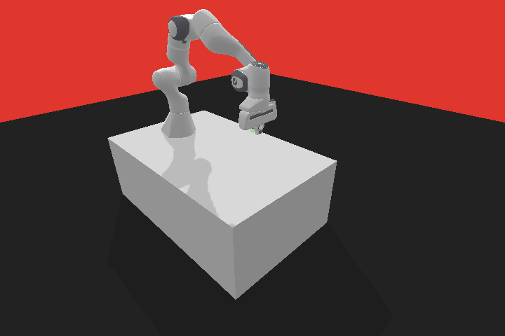
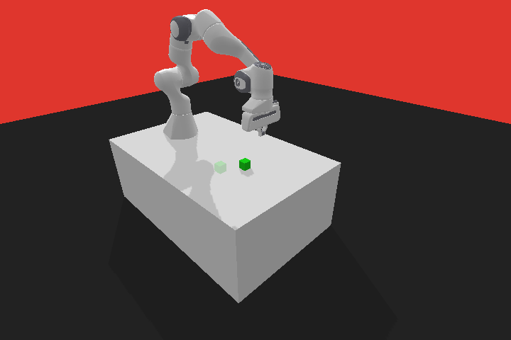
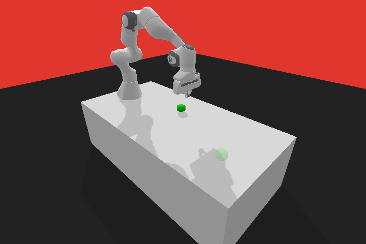
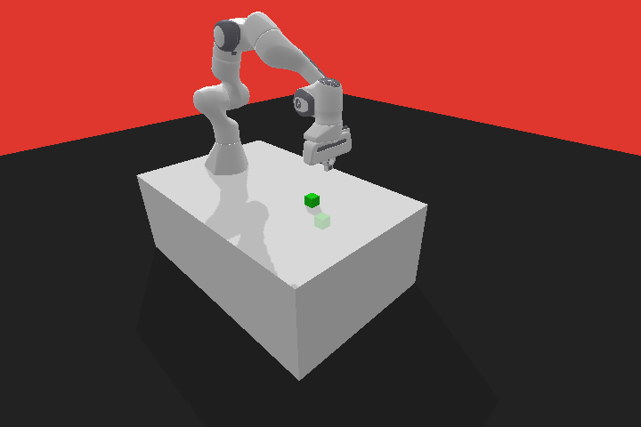

# Franka Panda Env

## Installation
```bash
pip install panda-gym
```


- [Documentation](https://panda-gym.readthedocs.io/en/latest/guide/install.html)
- [](https://colab.research.google.com/github/qgallouedec/panda-gym/blob/master/examples/PickAndPlace.ipynb)

## Environments

|                                  |                                                |
| :------------------------------: | :--------------------------------------------: |
|         `PandaReach-v3`          |                 `PandaPush-v3`                 |
|  |                  |
|         `PandaSlide-v3`          |             `PandaPickAndPlace-v3`             |
|  |  |
|         `PandaStack-v3`          |              `PandaFlip-v3`                    |
|  |  |
